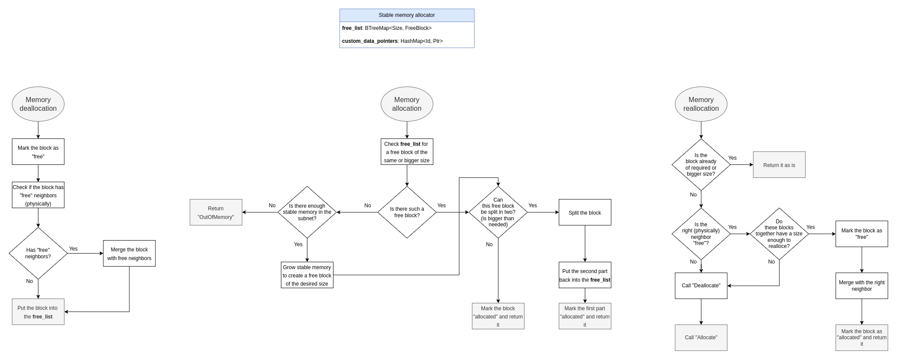

# Under the hood

### 1. Memory allocation
Memory allocator is a simple `CandidType` struct. More info on how functions like `stable_memory_init()` or `stable_memory_post_upgrade()`
affect the memory allocator can be found [at this page](https://docs.rs/ic-stable-memory/latest/ic_stable_memory/).

Here is a diagram that describes the complete memory management flow.
